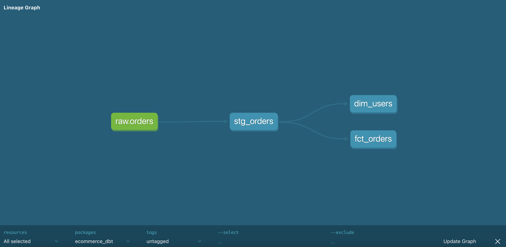

# E-commerce Analytics Pipeline (GCP · Airflow · BigQuery · dbt)

An end-to-end ELT pipeline that ingests e-commerce order data into BigQuery,
transforms it through layered dbt models into a dimensional star schema, and
validates it with automated data quality tests. Orchestrated with Apache Airflow.

---

## Architecture

```
bigquery-public-data        Airflow (Astro)            BigQuery                    dbt
 thelook_ecommerce   ──▶   ingestion DAG       ──▶   raw → staging → marts  ──▶  models + tests
                          (idempotent, daily)        (partitioned)              (star schema)
```

**Data flow:** public dataset → Airflow ingestion (idempotent, date-partitioned)
→ BigQuery `raw` → dbt `staging` (cleaned views) → dbt `marts` (star schema tables)

---

## dbt Lineage



`source: raw.orders → stg_orders → fct_orders + dim_users`

---

## Tech Stack

| Layer | Technology |
|---|---|
| Orchestration | Apache Airflow (Astro CLI, Docker) |
| Warehouse | Google BigQuery |
| Transformation | dbt (dbt-bigquery) |
| Language | Python, SQL |

---

## Pipeline Design

- **Idempotent ingestion** — Airflow loads write to date-partitioned tables
  (`CREATE OR REPLACE`), so re-runs for the same logical date are safe and
  produce identical results.
- **Layered modeling** — `staging` (cleaned views) → `marts` (dimensional tables),
  following dbt best practices.
- **Star schema** — `fct_orders` (fact) + `dim_users` (dimension).
- **Declared sources** — `raw.orders` registered as a dbt source, enabling full
  lineage and source freshness checks.
- **Custom schema routing** — a `generate_schema_name` macro routes models to
  exact datasets (`staging`, `marts`) instead of dbt's default prefixing.

---

## Data Quality Tests

dbt tests enforce data contracts on every run:

- `unique` and `not_null` on `order_id`
- `not_null` on `user_id`
- `accepted_values` on `status`

If upstream data drifts (new status values, duplicate or null keys), the
pipeline fails loudly instead of silently corrupting downstream analytics.

---

## Engineering Notes — Problems Solved

Real issues debugged while building this pipeline:

- **Stale DAG parse cache** — tasks ran from an outdated DAG version; resolved by
  restarting the scheduler to force a re-parse.
- **Cross-region conflict** — BigQuery cannot read/write across locations; the
  public dataset (`US` multi-region) conflicted with `us-central1` datasets.
  Resolved by colocating all datasets in `US`.
- **Service-account JWT clock drift** — the Docker container clock drifted after
  the host slept, causing `invalid_grant` auth failures. Resolved by resyncing
  Docker.
- **dbt schema routing** — models defaulted to a single dataset; added a custom
  `generate_schema_name` macro for exact dataset targeting.

---

## Running Locally

Start Airflow:

```bash
astro dev start
```

Run the dbt models and tests:

```bash
cd ecommerce_dbt
dbt run                                    # build staging + marts models
dbt test                                   # run data quality tests
dbt docs generate && dbt docs serve --port 8081   # view lineage graph
```

---

## Future Enhancements

- Accumulate historical partitions (currently replaces per run)
- GitHub Actions CI to run `dbt test` on every push
- Enrich `dim_users` with user attributes (join additional source tables)
- Add `dbt source freshness` monitoring
